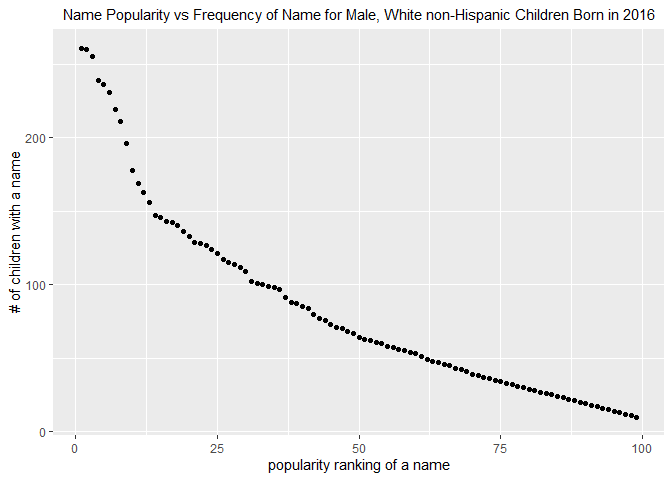

Homework 2
================
Kristi Chau
9/27/2019

## Problem 1

Read and clean Mr. Trash Wheel sheet

``` r
mtw_df = 
  read_excel("./data/HealthyHarborWaterWheelTotals2018-7-28.xlsx", range = "Mr. Trash Wheel!A2:N338") %>% 
  janitor::clean_names() %>% 
  drop_na(dumpster) %>% 
  mutate(sports_balls = as.integer(round(sports_balls)))

##specified sheet in range
```

Read and clean precipitation data for 2017 and 2018, combine them

``` r
precip_2017_df = 
  read_excel("./data/HealthyHarborWaterWheelTotals2018-7-28.xlsx", range = "2017 Precipitation!A2:B14") %>% 
  janitor::clean_names() %>%
  mutate(year = 2017)

precip_2018_df = 
  read_excel("./data/HealthyHarborWaterWheelTotals2018-7-28.xlsx",range = "2018 Precipitation!A2:B9") %>% 
  janitor::clean_names() %>%
  mutate(year = 2018)

precip_tidy = 
  bind_rows(precip_2017_df, precip_2018_df) %>% 
  janitor::clean_names() %>% 
  mutate(month = month.name[month]) %>%
  rename(total_precip = total) %>%
  select(month, year, total_precip)
```

The size of the Mr. Trash Wheel dataset is 3990 datapoints. Some
variables in this dataset are: dumpster, date, weight\_tons,
homes\_powered. The median number of sports balls in a dumpster in 2017
is 8. The size of the Precipitation dataset is 57 datapoints. The
precipitation dataset contains the variables: month, year,
total\_precip. The total precipitation in 2018 is 23.5.

## Problem 2

Cleaning the data in pols-month.csv

``` r
pols_month_df = 
  read.csv("./data/pols-month.csv") %>%
  separate(mon, c("year","month","day"),sep = "-") %>%
  mutate(month = month.name[as.integer(month)], year = as.integer(year), president = ifelse(prez_gop %in% c(1,2), "gop", ifelse(prez_dem %in% c(1,2), "dem", NA))) %>%
  select(-prez_gop, -prez_dem, -day)
```

Cleaning the data in snp.csv

``` r
snp_df = 
  read.csv("./data/snp.csv") %>%
  separate(date, c("day","month","year"),sep = "/") %>%
  mutate(month = month.name[as.integer(month)], year = as.integer(year)) %>%
  rename(closing_stock_index = close) %>%
  select(year, month, closing_stock_index, -day)
```

Cleaning the unemployment data

``` r
unemployment_df = 
  read.csv("./data/unemployment.csv") %>%
  pivot_longer(
    Jan:Dec,
    names_to = "month",
    values_to = "unemployment_percent"
  ) %>%
  mutate(month = month.name[match(month,month.abb)]) %>%
  janitor::clean_names()
```

Merging the datasets

``` r
pols_snp_data = 
  left_join(pols_month_df, snp_df, by = c("year","month"))

fte_data = 
  left_join(pols_snp_data, unemployment_df, by = c("year","month"))
```

The `pols_month_df` contained data about the number of national
politicians who are democratic or republic at any given time. The
`snp_df` contained data about the S\&P’s stock market index on dates of
observation. The `unemployment_df` contained data about the percentage
of unemployment at dates of measurement. The resulting merged dataset
has 15301 datapoints and 1391 observations. The years range from 1947 to
2015. Some key variables are: year, month, president,
closing\_stock\_index, unemployment\_percent.

## Problem 3

``` r
baby_names_data =
  read.csv("./data/Popular_Baby_Names.csv") %>%
  janitor::clean_names() %>%
  mutate(childs_first_name = str_to_title(child_s_first_name), ethnicity = case_when(ethnicity == "ASIAN AND PACI"~"ASIAN AND PACIFIC ISLANDER", ethnicity == "BLACK NON HISP"~"BLACK NON HISPANIC", ethnicity == "WHITE NON HISP"~"WHITE NON HISPANIC", TRUE~as.character(ethnicity))) %>%
  select(-child_s_first_name) %>%
  distinct()
```

Creating read-friendly tables

``` r
baby_names_data %>%
  filter(childs_first_name == "Olivia") %>%
  arrange(year_of_birth) %>%
  select(year_of_birth, rank, ethnicity) %>%
  kable(format = "pandoc", caption = "A ranking of the baby name Olivia over time")
```

| year\_of\_birth | rank | ethnicity                  |
| --------------: | ---: | :------------------------- |
|            2011 |    4 | ASIAN AND PACIFIC ISLANDER |
|            2011 |   10 | BLACK NON HISPANIC         |
|            2011 |   18 | HISPANIC                   |
|            2011 |    2 | WHITE NON HISPANIC         |
|            2012 |    3 | ASIAN AND PACIFIC ISLANDER |
|            2012 |    8 | BLACK NON HISPANIC         |
|            2012 |   22 | HISPANIC                   |
|            2012 |    4 | WHITE NON HISPANIC         |
|            2013 |    3 | ASIAN AND PACIFIC ISLANDER |
|            2013 |    6 | BLACK NON HISPANIC         |
|            2013 |   22 | HISPANIC                   |
|            2013 |    1 | WHITE NON HISPANIC         |
|            2014 |    1 | ASIAN AND PACIFIC ISLANDER |
|            2014 |    8 | BLACK NON HISPANIC         |
|            2014 |   16 | HISPANIC                   |
|            2014 |    1 | WHITE NON HISPANIC         |
|            2015 |    1 | ASIAN AND PACIFIC ISLANDER |
|            2015 |    4 | BLACK NON HISPANIC         |
|            2015 |   16 | HISPANIC                   |
|            2015 |    1 | WHITE NON HISPANIC         |
|            2016 |    1 | ASIAN AND PACIFIC ISLANDER |
|            2016 |    8 | BLACK NON HISPANIC         |
|            2016 |   13 | HISPANIC                   |
|            2016 |    1 | WHITE NON HISPANIC         |

A ranking of the baby name Olivia over time

``` r
baby_names_data %>%
  filter(gender == "MALE" & rank == 1) %>%
  arrange(year_of_birth) %>%
  select(year_of_birth, childs_first_name, ethnicity) %>%
  kable(format = "pandoc", caption = "Most popular male baby names over time")
```

| year\_of\_birth | childs\_first\_name | ethnicity                  |
| --------------: | :------------------ | :------------------------- |
|            2011 | Ethan               | ASIAN AND PACIFIC ISLANDER |
|            2011 | Jayden              | BLACK NON HISPANIC         |
|            2011 | Jayden              | HISPANIC                   |
|            2011 | Michael             | WHITE NON HISPANIC         |
|            2012 | Ryan                | ASIAN AND PACIFIC ISLANDER |
|            2012 | Jayden              | BLACK NON HISPANIC         |
|            2012 | Jayden              | HISPANIC                   |
|            2012 | Joseph              | WHITE NON HISPANIC         |
|            2013 | Jayden              | ASIAN AND PACIFIC ISLANDER |
|            2013 | Ethan               | BLACK NON HISPANIC         |
|            2013 | Jayden              | HISPANIC                   |
|            2013 | David               | WHITE NON HISPANIC         |
|            2014 | Jayden              | ASIAN AND PACIFIC ISLANDER |
|            2014 | Ethan               | BLACK NON HISPANIC         |
|            2014 | Liam                | HISPANIC                   |
|            2014 | Joseph              | WHITE NON HISPANIC         |
|            2015 | Jayden              | ASIAN AND PACIFIC ISLANDER |
|            2015 | Noah                | BLACK NON HISPANIC         |
|            2015 | Liam                | HISPANIC                   |
|            2015 | David               | WHITE NON HISPANIC         |
|            2016 | Ethan               | ASIAN AND PACIFIC ISLANDER |
|            2016 | Noah                | BLACK NON HISPANIC         |
|            2016 | Liam                | HISPANIC                   |
|            2016 | Joseph              | WHITE NON HISPANIC         |

Most popular male baby names over time

Create a scatter plot

``` r
pop_vs_freq_names = 
  baby_names_data %>%
  filter(gender == "MALE" & year_of_birth == 2016 & ethnicity == "WHITE NON HISPANIC") %>%
  ggplot(aes(x = rank, y = count)) +
  geom_point() +
  labs(title = "Name Popularity vs Frequency of Name for Male, White non-Hispanic Children Born in 2016") + xlab("popularity ranking of a name") + ylab("# of children with a name") + theme(plot.title = element_text(size = 11, hjust = 0.5))

ggsave("pop_vs_freq_names.pdf", pop_vs_freq_names, width = 8, height = 5)

pop_vs_freq_names
```

<!-- -->
